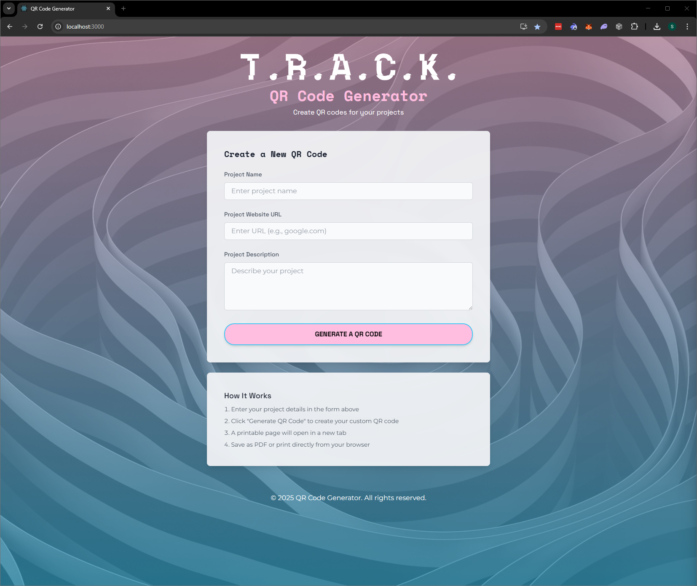

# QR Code Generator

A professional web application for creating and printing QR codes for projects. This easy-to-use tool helps you quickly generate QR codes with customized descriptions that can be printed or saved as PDF.

## Features

-   **Simple Form Interface**: Easily enter project name, URL, and description
-   **Instant Generation**: Generate QR codes with a single click
-   **Print-Ready Output**: Automatically opens a print-friendly page
-   **Responsive Design**: Works on desktop and mobile devices
-   **Accessibility**: Built with a11y best practices in mind

## Technology Stack

-   React 19
-   Tailwind CSS for styling
-   QRCode.js for QR code generation

## Getting Started

### Prerequisites

-   Node.js 18.0 or higher
-   npm or yarn

### Installation

1. Clone the repository

    ```bash
    git clone https://github.com/yourusername/qr-code-generator.git
    cd qr-code-generator
    ```

2. Install dependencies

    ```bash
    npm install
    # or
    yarn
    ```

3. Start the development server

    ```bash
    npm start
    # or
    yarn start
    ```

4. Open [http://localhost:3000](http://localhost:3000) in your browser

## Project Structure

```
src/
├── components/       # Reusable UI components
├── hooks/            # Custom React hooks
├── layouts/          # Layout components
├── pages/            # Page components
├── utils/            # Utility functions
├── App.js            # Main app component
├── index.js          # Entry point
└── ...
```

## Building for Production

```bash
npm run build
# or
yarn build
```

This creates an optimized production build in the `build` folder.

## Usage Guidelines

1. Enter your project name (e.g., "My Awesome Project")
2. Enter a valid URL (e.g., "https://myproject.com")
3. Add a brief description
4. Click "Generate QR Code"
5. The QR code will open in a new tab
6. Print or save as PDF from your browser

## License

[MIT](LICENSE)

---

Created with ❤️ using React
